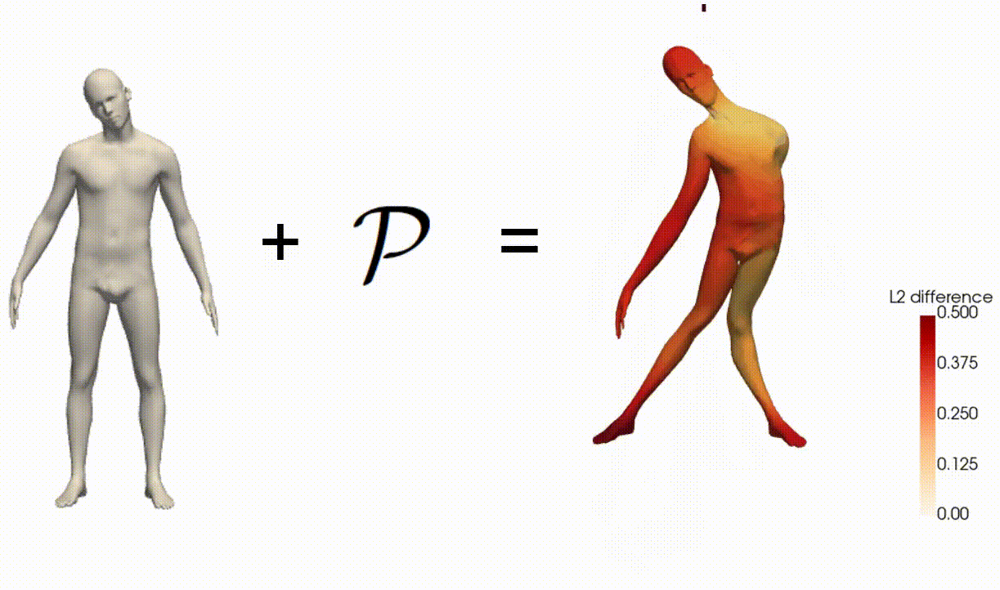
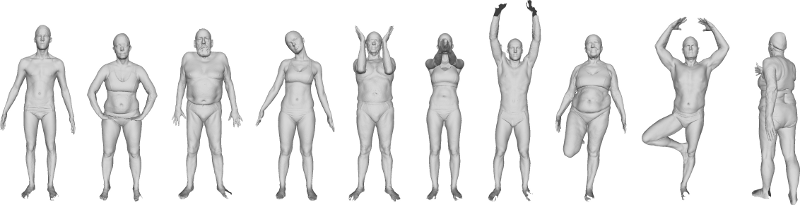
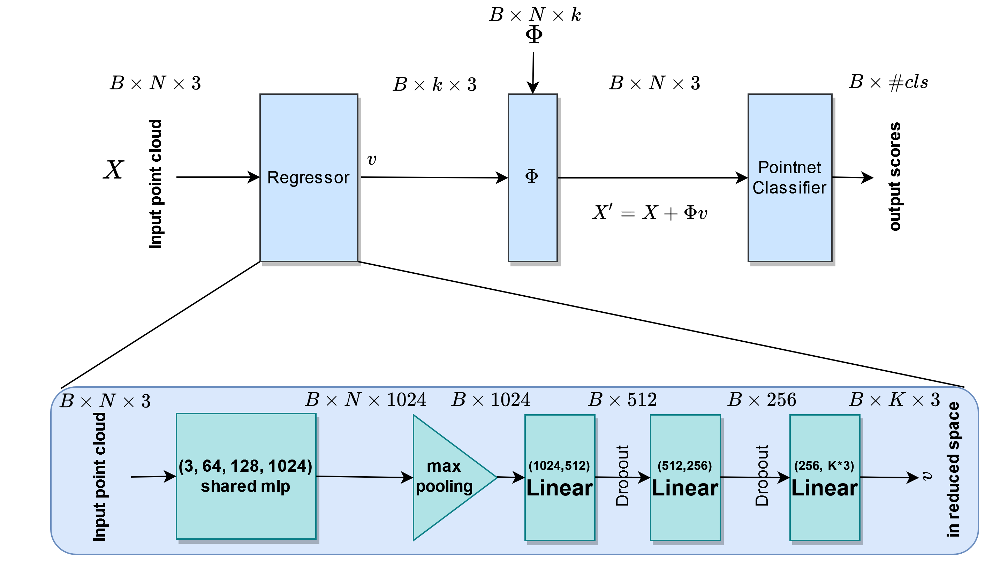

# Generating Band-Limited Adversarial Surfaces Using Neural Networks
<h1 align="center">
  
</h1>
  

  <a href="mailto:roeebs123@gmail.com">Roee Ben Shlomo</a> •
    <a href="mailto:yevgenimen@campus.technion.ac.il">Yevgeny Men</a> 
  

Generating adversarial examples is the art of creating a noise that is added to an input signal of a classifying neural network, and thus changing the network’s classification, while keeping the noise as tenuous as possible.

While the subject is well-researched in the 2D regime, it is lagging behind in the 3D regime, i.e. attacking a classifying network that works on 3D point-clouds or meshes and, for example, classifies the pose of people’s 3D scans.

As of now (2021), the vast majority of papers that describe adversarial attacks in this regime work by methods of optimizations. In this project we suggest a neural network that generates the attacks. This network utilizes PointNet’s architecture with some alterations.

- [Generating Band Limited Adversarial Surfaces Using Neural Networks](#Generating-Band-Limited-Adversarial-Surfaces-Using-Neural-Networks)
  * [Data](#data)
  * [Architecture](#architecture)
  * [Results](#results)
  * [Further Work](#further-work)

## Data
Created by Bogo et al., 2014, FAUST is the primary data-set that was used in this project.

It includes 10 subjects, as shown down below, each performing 10 different poses.

In this project we split the data as follows: the training set includes 70 of the meshes, the validation set 15 and the test set includes another 15.

<h1 align="center">
  
</h1>

## Architecture
The classifier that's being attacked is an instance of PointNet. It was trained by us and got classifications percentage of 90\%, 87\% and 87\% on the train, validation and test sets accordingly.

During the classifier training we fed it with augmented shapes, i.e we translated and rotated the shapes, otherwise during the adversarial training the attacking network would exploit this weakness and create "attacks" that aren't meaningful.

In order to create the attacks we altered PointNet's architecture and created an auto-encoder. It was altered into a couple of different models, and the architrecture of the most successful one is demonstrated in the figure down below.
<h1 align="center">
  
</h1>

## Results
In order to test the different methodologies we used Weights & Biases’ experiment trackingtool as well as their hyperparameter sweeps. In total over than 7,000 runs were made in order to get the best out of the models. Some of the attacks are presented down below.

<h1 align="center">
  
</h1>

## Further Work

Despite the fact the we managed to produce successful adversarial attacks, the vast majority of them were on the training set. The network couldn't manage to generalize and create (natural-looking) adversarial attacks on the validation & test sets. 

The problem comes from the fact that in contrast to 2D images where a change of a single pixel comes unnoticed, a change in single vertex of a mesh very much distorts the mesh because of it's faces. 

We've done a pretty thorough check with all kinds of losses, so perhaps a different model architecture that doesn't rely on PointNet could manage to get a generalization. 

## References
* [FAUST dataset](http://faust.is.tue.mpg.de/overview).
* [Carlini, Nicholas and David Wagner (2017), Towards Evaluating the Robustness of NeuralNetworks](https://arxiv.org/abs/1608.04644).
* [Qi, Charles R. et al. (2017), PointNet: Deep Learning on Point Sets for 3D Classificationand Segmentation](https://arxiv.org/abs/1612.00593).
* [Mariani, Giorgio et al. (2020), ‘Generating Adversarial Surfaces via Band-Limited Perturbations’](https://onlinelibrary.wiley.com/doi/10.1111/cgf.14083).
